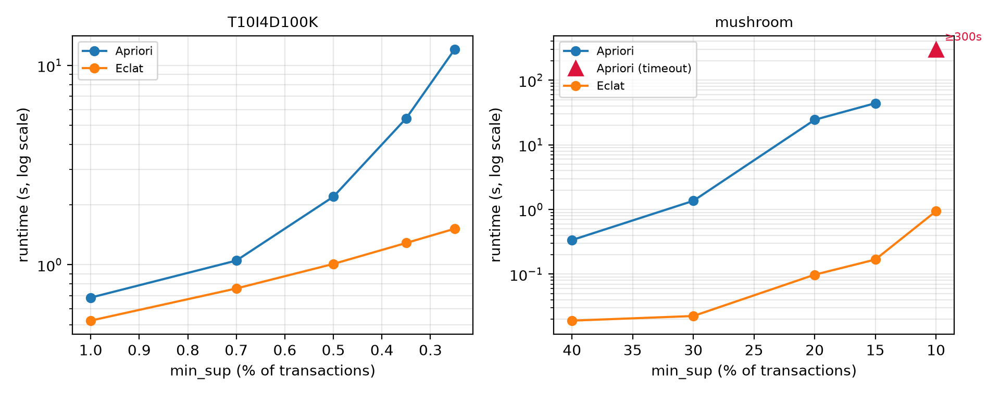
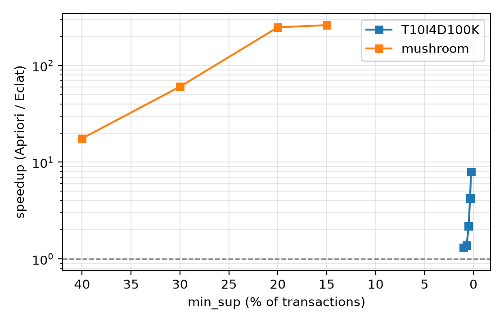

# Eclat vs Apriori：垂直交集挖掘的复现实验

> 一个可完整复现的小型实验仓库：用纯 Python 实现 Apriori 与 Eclat，
> 在公开数据集上验证 Eclat 对 Apriori 性能瓶颈的改进效果。
>
> *A reproducible benchmark of **Eclat** against **Apriori** for frequent itemset
> mining — pure-Python implementations, public datasets, a single controlled
> variable (`min_sup`).*

**一句话结论**：在 2 个公开数据集、共 10 组配置下，Eclat 的运行时间**均低于** Apriori，
且加速比随支持度降低**单调扩大**（最高 $\ge 319\times$）；
两者输出的频繁项集**完全一致**（已做一致性校验）。

---

## 1. 项目简介

本项目是数据挖掘算法与应用课程的课堂汇报实验代码。
Apriori 采用「逐层扫描 + 候选验证」的范式：每一层都要重新完整扫描数据库，
并生成和计数大量候选集。Eclat 将数据库一次性转置为**垂直格式**（项 → tidset），
用集合交运算替代扫描计数，用前缀等价类上的深度优先搜索替代逐层候选生成。

本仓库做的事情：

1. 用纯 Python 实现两种算法（同一套数据加载代码、同一套度量代码）；
2. 在公开数据集上扫描支持度阈值，测量**运行时间**与**峰值内存**；
3. 先校验两算法输出**完全一致**，再比较性能——保证比较是公平的；
4. 一键产出 CSV 与图表，供直接引用。

---

## 2. 结论速览

| 数据集（min_sup） | 频繁项集数 | Apriori (s) | Eclat (s) | 加速比 |
|---|---:|---:|---:|---:|
| mushroom (30%) | 2,735 | 1.36 | 0.02 | 60× |
| mushroom (20%) | 53,583 | 24.35 | 0.10 | 248× |
| mushroom (10%) | 574,513 | 超时（>300） | 0.94 | ≥319× |
| T10I4D100K (1.0%) | 385 | 0.68 | 0.52 | 1.31× |
| T10I4D100K (0.5%) | 1,073 | 2.19 | 1.01 | 2.17× |
| T10I4D100K (0.25%) | 7,703 | 12.04 | 1.51 | 7.95× |





---

## 3. 仓库结构

```
.
├── config.py            # 实验配置：数据集、支持度阶梯、时间/内存预算
├── download_data.py     # 一键下载公开数据集（含证书失效时的兜底逻辑）
├── dataset.py           # FIMI 格式读取与统计
├── apriori.py           # Apriori 实现（逐层 + 候选生成 + 自适应计数）
├── eclat.py             # Eclat 实现（垂直索引 + 位图 tidset + 前缀等价类 DFS）
├── verify.py            # 两算法结果一致性校验
├── run_experiment.py    # 主实验脚本 → results/summary.csv
├── plot_results.py      # 绘图脚本 → figures/*.png
├── results/             # 实验结果（已入库）
├── figures/             # 图表（已入库）
├── data/                # 数据集（不入库，由 download_data.py 获取）
├── slides/              # 可选：配套汇报 Slides（LaTeX Beamer 源码 + 编译后的 PDF）
├── requirements.txt
├── LICENSE
└── README.md
```

---

## 4. 环境要求

* Python >= 3.8（推荐 3.10+，`int.bit_count()` 更快）
* `matplotlib`（仅绘图需要）
* 可选：`mlxtend` + `pandas`（第三方交叉验证）

```bash
pip install -r requirements.txt
```

实测环境：Ubuntu on WSL2，Python 3.x，单线程，16 GB 内存。

---

## 5. 快速开始

```bash
git clone https://github.com/<你的用户名>/eclat-vs-apriori.git
cd eclat-vs-apriori

python download_data.py          # 1) 下载数据集（见第 11 节 FAQ）
python run_experiment.py --quick # 2) 冒烟测试，约 1 分钟
python run_experiment.py --plot  # 3) 完整实验 + 出图，约 8~10 分钟
```

跑完后：

* `results/summary.csv` —— 全部实测数据；
* `figures/fig_time_combined.png`、`fig_speedup.png` —— 可直接引用的图。

---

## 6. 实验设计

| 项 | 设置 |
|---|---|
| 数据集 | mushroom（8,124 事务 / 119 项）、T10I4D100K（100,000 事务 / 870 项），均为 FIMI 公开数据集 |
| 自变量 | **仅支持度阈值**，逐档降低 |
| 度量 | 运行时间（重复运行取最小值）、峰值内存、频繁项集数量、加速比 |
| 实现语言 | 两种算法均为纯 Python 单线程实现，共用同一套数据加载代码 |
| 公平性 | 两者使用完全相同的 `min_sup`；**先校验输出项集完全一致，再比较性能** |
| 计时范围 | 仅算法本体，不含文件读取与结果输出 |
| 预算 | 单次运行 300 s 上限，超时记为 `timeout` 并保留部分结果 |

**正确性前置校验**（`verify.py`）在每次实验开始时执行：
若两算法输出的频繁项集集合不一致，脚本会明确报警，此时任何性能数字都不可信。

---

## 7. 命令行参数

| 参数 | 默认值 | 说明 |
|---|---|---|
| `--datasets` | `mushroom T10I4D100K` | 指定数据集 |
| `--supports` | 由 `config.py` 决定 | 覆盖支持度阶梯，如 `--supports 0.01 0.005` |
| `--repeat` | 3 | 计时重复次数上限（单次 >1 s 后自动不再重复） |
| `--timeout` | 300 | 单次算法运行时限（秒） |
| `--mem-limit-mb` | 6000 | 进程内存上限（MB），超限安全中断 |
| `--no-memory` | 关 | 跳过峰值内存测量（更快） |
| `--quick` | 关 | 每个数据集只跑前 2 档、单次计时、不测内存 |
| `--resume` | 关 | 跳过 `summary.csv` 中已完成的组合 |
| `--plot` | 关 | 实验结束后自动调用 `plot_results.py` |

---

## 8. 输出说明

### `results/summary.csv` 字段

| 字段 | 含义 |
|---|---|
| `dataset` / `num_transactions` / `num_items` | 数据集标识 |
| `min_sup_rel` / `min_sup_abs` | 相对支持度 / 绝对支持度 |
| `algorithm` / `status` | `apriori` / `eclat`；`ok` / `timeout` / `memory_limit` / `skipped_after_failure` |
| `time_min_s` / `time_mean_s` / `time_std_s` | 运行时间（秒） |
| `peak_mem_mb` | 峰值内存（`tracemalloc`，仅统计 Python 堆） |
| `num_freq_itemsets` | 频繁项集数量 |
| `search_min_s` | Eclat 搜索净耗时（不含一次性索引构建） |
| `tidset_build_s` | Eclat 一次性垂直索引构建耗时 |
| `speedup_vs_apriori` | 加速比 = Apriori 时间 ÷ Eclat 时间 |

### `figures/`

* `fig_time_combined.png` —— 两个数据集的时间-支持度曲线（**主图**）
* `fig_speedup.png` —— 加速比-支持度曲线
* `fig_time_<dataset>.png` —— 各数据集单独视图

---

## 9. 实测结果（完整）

**mushroom（8,124 事务 / 119 项）**

| min_sup | 频繁项集数 | Apriori (s) | Eclat (s) | 加速比 |
|---:|---:|---:|---:|---:|
| 40% | 565 | 0.34 | 0.02 | 17.6× |
| 30% | 2,735 | 1.36 | 0.02 | 60.4× |
| 20% | 53,583 | 24.35 | 0.10 | 248× |
| 15% | 98,575 | 43.97 | 0.17 | 262× |
| 10% | 574,513 | 超时（>300） | 0.94 | ≥319× |

**T10I4D100K（100,000 事务 / 870 项）**

| min_sup | 频繁项集数 | Apriori (s) | Eclat (s) | 加速比 |
|---:|---:|---:|---:|---:|
| 1.0% | 385 | 0.68 | 0.52 | 1.31× |
| 0.7% | 603 | 1.05 | 0.76 | 1.38× |
| 0.5% | 1,073 | 2.19 | 1.01 | 2.17× |
| 0.35% | 2,761 | 5.42 | 1.28 | 4.22× |
| 0.25% | 7,703 | 12.04 | 1.51 | 7.95× |

> mushroom 在 10% 支持度处，Apriori 运行满 300 s 仍未完成（已挖到 552,084 个项集），
> 而 Eclat 用 0.94 s 挖出全部 574,513 个项集。

---

## 10. 实现说明与复现约定

1. **Apriori 的计数策略自适应**：每一层在「事务子集枚举」与「逐候选匹配」之间按估算代价择优选。
   两者都不改变候选生成过程与最终结果，目的是让基线尽可能快，使对比更保守。
2. **Eclat 的 tidset 用位图**（Python 大整数，每个事务占 1 bit）：
   交集 = 按位与，支持度 = popcount。这是 Eclat 家族的标准优化之一。
3. **垂直索引一次构建、多档复用**：索引按支持度阶梯的最低档构建，
   之后逐档过滤，避免在支持度扫描中重复支付构建成本。
4. **计时口径**：Eclat 的 `time_min_s` 为**冷启动口径**（含一次性索引构建），
   `search_min_s` 为其搜索净耗时；Apriori 无预处理，`time_min_s` 即其全部耗时。
5. **内存口径**：`peak_mem_mb` 为 `tracemalloc` 统计的 **Python 堆峰值**，
   不含解释器与预建索引的开销，两算法同口径可比。
6. **超时不是失败**：超时的配置会保留「已挖到的项集数」与「中止层级」，
   并按代价单调性跳过更低的支持度，避免无谓等待。

---

## 11. 常见问题

**Q1：`download_data.py` 下载失败？**

FIMI 官方站点（`fimi.uantwerpen.be`）的 HTTPS 证书已过期，脚本会自动降级重试
（跳过证书验证）、并尝试 Wayback 快照。若仍失败，可手动获取任一方式后放入 `data/`：

```bash
# 方式一：绕过证书校验
wget --no-check-certificate -P data https://fimi.uantwerpen.be/data/mushroom.dat
curl -kL -o data/T10I4D100K.dat https://fimi.uantwerpen.be/data/T10I4D100K.dat

# 方式二：浏览器打开（可手动忽略证书告警）后另存
# https://fimi.uantwerpen.be/data/mushroom.dat
# https://web.archive.org/web/2024/https://fimi.uantwerpen.be/data/mushroom.dat
```

行数校验：`mushroom.dat` = 8124 行、`T10I4D100K.dat` = 100000 行。
脚本按**文件名**识别数据集，与来源无关。

**Q2：跑得太慢？**

`python run_experiment.py --quick`（约 1 分钟），或加 `--no-memory`、调小 `--repeat`。
完整实验的耗时瓶颈是 mushroom 10% 档：Apriori 会跑满 300 s 超时上限。

**Q3：`peak_mem_mb` 为什么和系统监视器看到的不一样？**

`tracemalloc` 只统计 Python 堆上的分配，不含解释器自身开销。两算法同口径比较，
因此可比；它不是进程 RSS。

**Q4：Eclat 比 Apriori 慢怎么办？**

先确认一致性校验是否通过（脚本会打印），再确认数据文件行数是否正确。
若结果仍如此，请如实记录——这也是有效结论。

---

## 12. 引用与许可

若本仓库对你的工作有帮助，请引用：

```bibtex
@misc{eclat_vs_apriori,
  title  = {Eclat vs Apriori: A Reproducible Benchmark of Frequent Itemset Mining},
  author = {<你的名字>},
  year   = {2026},
  url    = {https://github.com/<你的用户名>/eclat-vs-apriori}
}
```

核心参考文献见仓库 `slides/` 中的汇报 Slides 与以下文献：

1. R. Agrawal and R. Srikant, "Fast algorithms for mining association rules," VLDB, 1994.
2. M. J. Zaki, "Scalable algorithms for association mining," IEEE TKDE, 12(3):372–390, 2000.
3. B. Goethals and M. J. Zaki, "Advances in frequent itemset mining implementations: Report on FIMI'03," SIGKDD Explorations, 6(1):109–117, 2004.

数据来源：FIMI Repository — <https://fimi.uantwerpen.be/data/>

本项目采用 [MIT License](LICENSE)。
